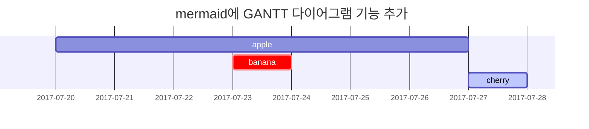

이 포스팅은 마크다운 문법을 이용한 문서를 어떻게 작성해야 하는지 소개한다. 동시에 각 요소의 렌더링이 어떻게 되는지 보여준다. 이 블로그 베이스 테마인 [Chirpy](https://chirpy.cotes.page/)의 포스팅을 참고했다.

마크다운 문서는 메모장으로도 작성 가능하지만 특별한 툴을 이용하면 더 손쉽게 작성할 수 있다. 가장 대표적인 것을 꼽자면 `Visual Studio Code` 가 있으며, 그 외에 [MarkText Markdown Editor](https://github.com/marktext/marktext#download-and-installation), 또는 웹 애플리케이션인 <https://stackedit.io> 를 사용할 수 있다.


## 제목과 문단

<!-- markdownlint-capture -->
<!-- markdownlint-disable -->

# H1 - heading 
{: .mt-4 .mb-0 }
- TOC 표시에서 제외됨
- margin-top 있음

## H2 - heading
{: data-toc-skip='' .mt-4 .mb-0 }
- margin-top 있음

### H3 - heading
{: data-toc-skip='' .mt-4 .mb-0 }

#### H4 - heading
{: data-toc-skip='' .mt-4 .mb-0 }

##### H5 - heading
{: data-toc-skip='' .mt-4 .mb-0 }

###### H6 - heading 
{: data-toc-skip='' .mt-4 }
- 최대 한계 Heading
<!-- markdownlint-restore -->

<br>

이것은 문단이다. 대한민국은 민주공화국이다. 탄핵결정은 공직으로부터 파면함에 그친다. 그러나, 이에 의하여 민사상이나 형사상의 책임이 면제되지는 아니한다. 국회의원이 회기전에 체포 또는 구금된 때에는 현행범인이 아닌 한 국회의 요구가 있으면 회기중 석방된다. 국회는 국가의 예산안을 심의·확정한다. 대통령은 제1항과 제2항의 처분 또는 명령을 한 때에는 지체없이 국회에 보고하여 그 승인을 얻어야 한다. 국무총리는 대통령을 보좌하며, 행정에 관하여 대통령의 명을 받아 행정각부를 통할한다. 군인은 현역을 면한 후가 아니면 국무총리로 임명될 수 없다. 감사원은 원장을 포함한 5인 이상 11인 이하의 감사위원으로 구성한다. 피고인의 자백이 고문·폭행·협박·구속의 부당한 장기화 또는 기망 기타의 방법에 의하여 자의로 진술된 것이 아니라고 인정될 때 또는 정식재판에 있어서 피고인의 자백이 그에게 불리한 유일한 증거일 때에는 이를 유죄의 증거로 삼거나 이를 이유로 처벌할 수 없다.


```md
# H1 - heading (TOC 표시 제외됨, margin-top 있음)
## H2 - heading (margin-top 있음)
### H3 - heading
#### H4 - heading
##### H5 - heading
###### H6 - heading (최대 한계)
```
{: .nolineno }

### 목차에 표시되지 않는 제목

#### 이 제목은 목차에 표시되지 않는다.
{: data-toc-skip=''}

```md
#### 이 제목은 목차에 표시되지 않는다.
{: data-toc-skip=''}
```


## 리스트

### 순서 리스트

1. 첫번째 항목
2. 두번째 항목
3. 세번째 항목

```md
1. 첫번째 항목
2. 두번째 항목
3. 세번째 항목
```
{: .nolineno }

### 비순서 리스트

- Chapter
  - Section
    - Paragraph

```md
- Chapter
  - Section
    - Paragraph
```
{: .nolineno }

### TODO 리스트

- [ ] 작업
  - [x] Step 1
  - [x] Step 2
  - [ ] Step 3

```md
- [ ] 작업
  - [x] Step 1
  - [x] Step 2
  - [ ] Step 3
```
{: .nolineno }

### 설명 리스트

태양
: 지구 궤도 중심에 있는 항성

달
: 지구의 위성으로, 햇빛을 반사함

```md
태양
: 지구 궤도 중심에 있는 항성

달
: 지구의 위성으로, 햇빛을 반사함
```
{: .nolineno }


## 인용문

> 인용문은 이렇게 표시됩니다.

```md
> 인용문은 이렇게 표시됩니다.
```
{: .nolineno }


## 프롬프트

<!-- markdownlint-capture -->
<!-- markdownlint-disable -->
> `tip` 타입 프롬프트 예시입니다.
{: .prompt-tip }

> `info` 타입 프롬프트 예시입니다.
{: .prompt-info }

> `warning` 타입 프롬프트 예시입니다.
{: .prompt-warning }

> `danger` 타입 프롬프트 예시입니다.
{: .prompt-danger }
<!-- markdownlint-restore -->

```md
> `tip` 타입 프롬프트 예시입니다.
{: .prompt-tip }

> `info` 타입 프롬프트 예시입니다.
{: .prompt-info }

> `warning` 타입 프롬프트 예시입니다.
{: .prompt-warning }

> `danger` 타입 프롬프트 예시입니다.
{: .prompt-danger }
```
{: .nolineno }


## 테이블

| Company                      | Contact          | Country |
| :--------------------------- | :--------------- | ------: |
| Alfreds Futterkiste          | Maria Anders     | Germany |
| Island Trading               | Helen Bennett    |      UK |
| Magazzini Alimentari Riuniti | Giovanni Rovelli |   Italy |

```md
| Company                      | Contact          | Country |
| :--------------------------- | :--------------- | ------: |
| Alfreds Futterkiste          | Maria Anders     | Germany |
| Island Trading               | Helen Bennett    |      UK |
| Magazzini Alimentari Riuniti | Giovanni Rovelli |   Italy |
```
{: .nolineno }


## 링크

다이렉트 링크: <https://lja3723.github.io>

간접 링크: [링크 대체 텍스트](https://lja3723.github.io)

```md
다이렉트 링크: <https://lja3723.github.io>

간접 링크: [링크 대체 텍스트](https://lja3723.github.io)
```
{: .nolineno}


## 각주

[^real]: `각주 설명문`은 포스팅 아무 곳이나 적어도 포스팅 맨 하단에 표시된다.

각주를 삽입할 수 있다. 삽입하게 되면 자동으로 포스팅 맨 밑에 *각주 리스트*가 만들어진다.
숫자[^footnote]를 클릭하면 포스팅 밑의 각주로 이동한다. **각주 이름**은 숫자 또는 영어만 가능하다[^한글은-안된다].
각주를 삽입하면 동일한 이름의 **각주 설명문** [^real]을 삽입해야 한다. 이것은 _정말로_ 포스팅 아무 곳이나 삽입 가능하다. 각주 사용 시 포스팅 맨 하단 **각주 Heading**을 잊지 말자.

```md
각주 삽입은 이렇게[^footnote] 하면 된다.
각주 설명문은 포스팅 아무곳이나 아래처럼 쓰자.
[^footnote]: 각주 설명문
```
{: .nolineno}


## 인라인 코드

인라인 코드 예시: `Hello, World!` 이렇게 사용한다.

```md
인라인 코드 예시: `Hello, World!` 이렇게 사용한다.
```
{: .nolineno}


## 파일경로

파일 경로 예시: `/path/to/the/file.extend`{: .filepath}

```md
파일 경로 예시: `/path/to/the/file.extend`{: .filepath}
```
{: .nolineno}


## 코드 블록

### 평문

```text
평문을 작성할 수 있으며, 문법 강조가 없다.
```

````md
```text
평문을 작성할 수 있으며, 문법 강조가 없다.
```
````

### 줄 번호 제거
```text
이렇게 줄 번호가 없는 코드 블록을 작성할 수 있다.
깔끔한 표현이 가능하다.
```
{: .nolineno }

````md
```text
이렇게 줄 번호가 없는 코드 블록을 작성할 수 있다.
깔끔한 표현이 가능하다.
```
{: .nolineno }
````
{: .nolineno }


### 특정 언어

```bash
if [ $? -ne 0 ]; then
  echo "The command was not successful.";
  #do the needful / exit
fi;
```

```c
#include <stdio.h>

int main(void) {
    printf("Hello, World!");
    return 0;
}
```

```java
public class Hello {
    public static void main(String[] args) {
        System.out.println("Hello, World!");
    }
}
```

```console
10 15
8 29 267 81 9 83 817 93 82 7 991 82 602 741 92
```

```terminal
4 9
false
0 1 1 1 0 1 1 0 1
0 1 0 0 1 0 0 1 0
0 0 1 1 0 1 1 1 1
0 0 0 1 0 0 1 0 0 
```
----
````md
```bash
if [ $? -ne 0 ]; then
  echo "The command was not successful.";
  #do the needful / exit
fi;
```

```c
#include <stdio.h>

int main(void) {
    printf("Hello, World!");
    return 0;
}
```

```java
public class Hello {
    public static void main(String[] args) {
        System.out.println("Hello, World!");
    }
}

```console
10 15
8 29 267 81 9 83 817 93 82 7 991 82 602 741 92
```

```terminal
4 9
false
0 1 1 1 0 1 1 0 1
0 1 0 0 1 0 0 1 0
0 0 1 1 0 1 1 1 1
0 0 0 1 0 0 1 0 0 
```
````
{: .nolineno}

### 특정 파일 이름

```sass
@import
  "colors/light-typography",
  "colors/dark-typography";
```
{: file='_sass/jekyll-theme-chirpy.scss'}

````md
```sass
@import
  "colors/light-typography",
  "colors/dark-typography";
```
{: file='_sass/jekyll-theme-chirpy.scss'}
````
{: .nolineno }


## 수학 표기

수학은 [**MathJax**](https://www.mathjax.org/)를 사용하여 지원된다.

$$
\begin{equation}
  \sum_{n=1}^\infty 1/n^2 = \frac{\pi^2}{6}
  \label{eq:series}
\end{equation}
$$

$a \ne 0$ 일 때, 2차방정식 $ax^2 + bx + c = 0$ 의 가능한 두 답은

$$ x = {-b \pm \sqrt{b^2-4ac} \over 2a} $$

이다.

다음은 그 외의 여러가지 수학 표기 예시이다.

$$
R_x=\begin{pmatrix}
1 & 0 & 0 & 0 & 0  \\
1 & 0 & 0 & 0 & 0 \\
cos(a) & -sin(a) & 0 & 0 & 0\\
\end{pmatrix}
$$

$$
m=\frac{b_y}{a_x}
$$

```tex
$$
\begin{equation}
  \sum_{n=1}^\infty 1/n^2 = \frac{\pi^2}{6}
  \label{eq:series}
\end{equation}
$$

$a \ne 0$ 일 때, 2차방정식 $ax^2 + bx + c = 0$ 의 가능한 두 답은

$$ x = {-b \pm \sqrt{b^2-4ac} \over 2a} $$

$$
R_x=\begin{pmatrix}
1 & 0 & 0 & 0 & 0  \\
1 & 0 & 0 & 0 & 0 \\
cos(a) & -sin(a) & 0 & 0 & 0\\
\end{pmatrix}
$$

$$
m=\frac{b_y}{a_x}
$$
```


## Mermaid SVG



````md

````


## 이미지

### 기본 옵션 (with 캡션)

> 이미지 캡션은 위치 지정이 되지 않을 때만 추가된다.
{: .prompt-warning}


_캡션: 풀스크린 너비와 가운데 정렬 적용_

```md

_캡션: 풀스크린 너비와 가운데 정렬 적용_
```
{: .nolineno }

### 왼쪽 정렬

{: .normal}

```md
{: .normal}
```
{: .nolineno }

### 왼쪽 플로팅

{: .left width="400" }
행정권은 대통령을 수반으로 하는 정부에 속한다. 언론·출판에 대한 허가나 검열과 집회·결사에 대한 허가는 인정되지 아니한다. 명령·규칙 또는 처분이 헌법이나 법률에 위반되는 여부가 재판의 전제가 된 경우에는 대법원은 이를 최종적으로 심사할 권한을 가진다. 대법관은 대법원장의 제청으로 국회의 동의를 얻어 대통령이 임명한다. 모든 국민은 법률이 정하는 바에 의하여 선거권을 가진다. 국군은 국가의 안전보장과 국토방위의 신성한 의무를 수행함을 사명으로 하며, 그 정치적 중립성은 준수된다. 비상계엄이 선포된 때에는 법률이 정하는 바에 의하여 영장제도, 언론·출판·집회·결사의 자유, 정부나 법원의 권한에 관하여 특별한 조치를 할 수 있다. 제1항의 탄핵소추는 국회재적의원 3분의 1 이상의 발의가 있어야 하며, 그 의결은 국회재적의원 과반수의 찬성이 있어야 한다. 다만, 대통령에 대한 탄핵소추는 국회재적의원 과반수의 발의와 국회재적의원 3분의 2 이상의 찬성이 있어야 한다. 국채를 모집하거나 예산외에 국가의 부담이 될 계약을 체결하려 할 때에는 정부는 미리 국회의 의결을 얻어야 한다.

```md
{: .left width="400" }
Any Sentences ......
```
{: .nolineno }

### 오른쪽 플로팅

{: .right width="400" }
대통령의 선거에 관한 사항은 법률로 정한다. 국회가 재적의원 과반수의 찬성으로 계엄의 해제를 요구한 때에는 대통령은 이를 해제하여야 한다. 위원은 탄핵 또는 금고 이상의 형의 선고에 의하지 아니하고는 파면되지 아니한다. 국가원로자문회의의 조직·직무범위 기타 필요한 사항은 법률로 정한다. 각급 선거관리위원회의 조직·직무범위 기타 필요한 사항은 법률로 정한다. 국무총리·국무위원 또는 정부위원은 국회나 그 위원회에 출석하여 국정처리상황을 보고하거나 의견을 진술하고 질문에 응답할 수 있다. 국회의 정기회는 법률이 정하는 바에 의하여 매년 1회 집회되며, 국회의 임시회는 대통령 또는 국회재적의원 4분의 1 이상의 요구에 의하여 집회된다. 국회는 정부의 동의없이 정부가 제출한 지출예산 각항의 금액을 증가하거나 새 비목을 설치할 수 없다. 위원은 정당에 가입하거나 정치에 관여할 수 없다. 법관은 탄핵 또는 금고 이상의 형의 선고에 의하지 아니하고는 파면되지 아니하며, 징계처분에 의하지 아니하고는 정직·감봉 기타 불리한 처분을 받지 아니한다.

```md
{: .right width="400" }
Any Sentences ......
```
{: .nolineno }

### 다크/라이트 모드 & 그림자

아래 이미지는 현재 다크/라이트 모드인지에 따라 다르게 표시된다. 그리고 그림자도 적용되어 있다.

{: .light .shadow w='1200' h='630' }
{: .dark .shadow w='1200' h='630' }

```md
{: .light .shadow w='1200' h='630' }
{: .dark .shadow w='1200' h='630' }
```
{: .nolineno }

### 프리뷰 이미지

본 포스팅과 같이 프리뷰 이미지를 첨부할 수 있다. Front Matter에 명시하며, 이미지 크기는 `1200 x 630`, 사이즈는 약 `256B`가 권장된다.
LQIP 이미지를 등록할 수 있으며, [Image to Base64 Converter](https://codebeautify.org/image-to-base64-converter)를 이용해 base64 인코딩이 가능하다.

```yml
---
image:
  path: /assets/img/posts/preview-demo.png
  lqip: data:image/webp;base64,UklGRrYAAABXRUJQVlA4WAoAAAAgAAAADwAABwAAVlA4IJgAAAAQAwCdASoQAAgAAMASJbACdLoB+AH4gM4ABEQfW3Oz1YAA/m0J/+K7Vq745XFrH22gwP8Q3t+w3rHUtTf66e2jHKRK0/9v+EUdNihFSNXt/Y2L0mYTmpS91ePhkmff1l8LyUC9qfbUlOOfr/pgsWuyPD/+w0zfxs2IuOH6BOzm1PbDYP/6cpX3t4vWne8f6+IuZvh25wAAAA==
  alt: "포스팅 프리뷰 이미지 데모 (출처: https://unsplash.com/ko)"
---
```


## 동영상

유튜브 영상 삽입은 Liquid 문법을 이용한다.




```liquid

```
{: .nolineno }



## 추가 문법
더 다양한 문법은 [Chirpy 사이트의 이 포스팅](https://chirpy.cotes.page/posts/write-a-new-post/)을 참고하자.


<br><br><br><br>

---
<!-- omit from toc -->
#### 각주
{: data-toc-skip=''}

[^footnote]: 각주 설명문, [네이버 홈페이지](https://www.naver.com/)
[^한글은-안된다]: 한글 각주 이름은 불가능하다.
